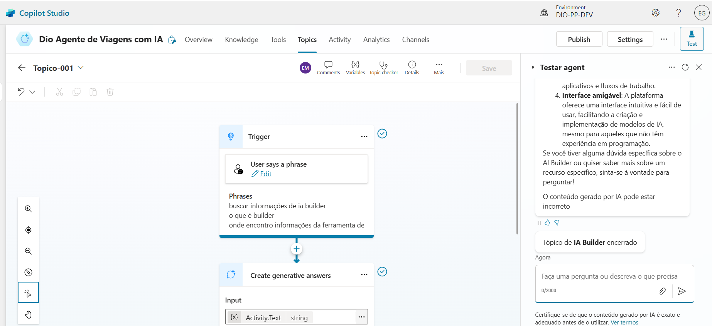
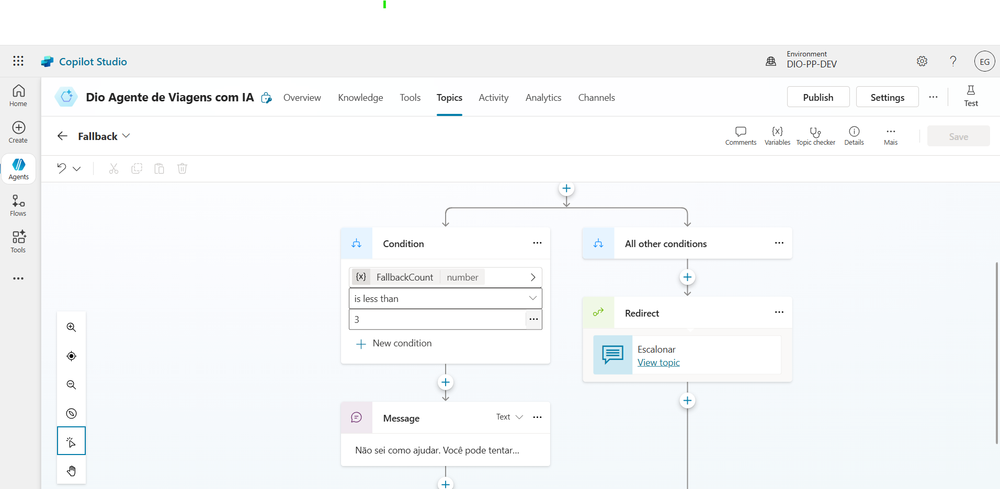

- Crie um Copiloto no Microsoft Copilot Studio:
    - Baseado em Modelo;
    - Customize um tópico
    - Personalize uma mensagem de erro de tópico
    - Customize a qualidade de resposta com GenAI

